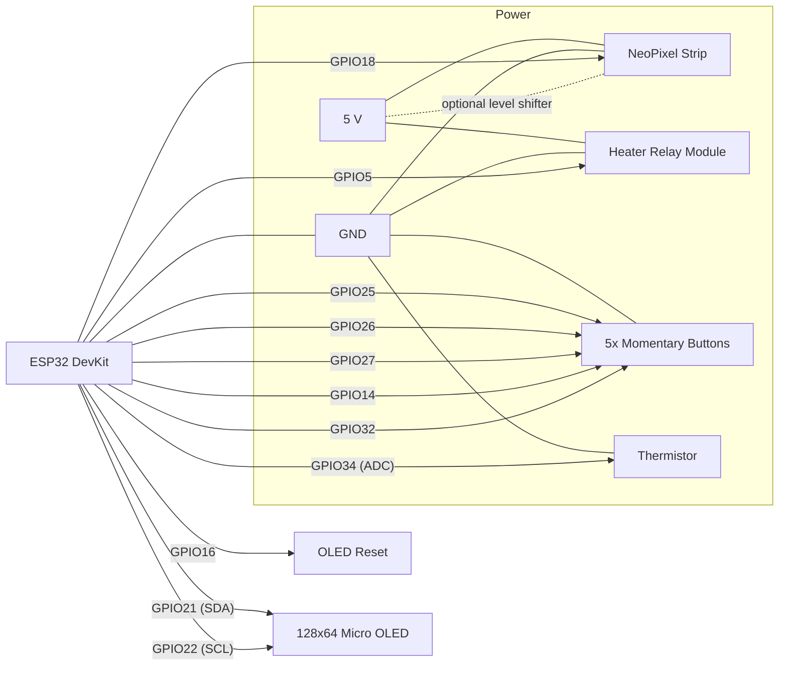

# DigitalFirePlace

Wifi control upgrade for electic fireplace

## Firmware sketch

Source files for the controller firmware live in `src/`. The main sketch `DigitalFirePlace.ino`
initialises the relay, thermistor, five buttons (temperature up/down, brightness up/down, and a
mode selector), 10 NeoPixels, and the Adafruit Micro OLED display. Supporting modules provide
configuration constants (`fireplace_config.h`), a flame animation (`fire_animation.cpp`), and an
optional ESP32 HTTP server. The mode button cycles between **Fire** (animation only), **Fire+Heat**
(animation with thermostat control), and **Heat** (thermostat control with the flame animation
disabled).


## Required Arduino libraries

Install the following Arduino libraries via the Library Manager:

- **Adafruit GFX Library**
- **Adafruit SSD1306** (configured for the 128×64 Micro OLED)
- **Adafruit NeoPixel**
- **WiFi** and **WebServer** (bundled with the ESP32 Arduino core) for the optional web UI

## Build and upload (Arduino IDE)

1. Open the Arduino IDE and select **File → Open...**, then choose `src/DigitalFirePlace.ino`.
2. Select the target board (ESP32 Dev Module recommended) and the appropriate serial port.
3. Ensure the I2C address in `fireplace_config.h` matches your OLED (default `0x3C`). Adjust pin
   assignments, thermistor calibration constants, and Wi-Fi credentials if your wiring or
   network differs.
4. Click **Sketch → Verify/Compile** to build the firmware.
5. Click **Sketch → Upload** to flash the firmware to your board.

## Build and upload (ESP-IDF via Arduino component)

If you prefer ESP-IDF, add this repository as an Arduino component project and build with:

```bash
idf.py set-target esp32
idf.py build
idf.py -p /dev/ttyUSB0 flash monitor
```

The sketch relies on the Arduino core for ESP32. Confirm that the Arduino-ESP32 component is
installed and enabled within your ESP-IDF workspace.

## Web interface

When built for ESP32, the firmware attempts to join the Wi-Fi network configured in
`src/fireplace_config.h` and starts a simple HTTP server on port 80. Browse to the module's IP address to
view the current room temperature, target temperature, brightness, heater state, and mode, and
submit updates via a form without using the physical buttons.

## Wiring diagram

Component connections are defined in `src/fireplace_config.h` and shown below for an ESP32 DevKit-style
board. Buttons are configured as active-low with the internal pull-up enabled, so wire each one
between the listed GPIO and ground. Use a 5 V supply for the NeoPixel strip and relay module as
required by your hardware, and share ground with the ESP32. The Micro OLED uses the default I²C
bus (`GPIO 21`/`GPIO 22`) and a dedicated reset pin.

| Component                          | ESP32 pin | Notes                                               |
| ---------------------------------- | --------- | --------------------------------------------------- |
| Heater relay input                 | GPIO 5    | Active-high output to drive the relay module        |
| Thermistor voltage divider output  | GPIO 34   | Analog input, pair the sensor with a 10 kΩ resistor |
| NeoPixel data                      | GPIO 18   | 10 LEDs, 800 kHz GRB                                |
| Temperature up button              | GPIO 25   | Active-low to ground                                |
| Temperature down button            | GPIO 26   | Active-low to ground                                |
| Brightness up button               | GPIO 27   | Active-low to ground                                |
| Brightness down button             | GPIO 14   | Active-low to ground                                |
| Mode button                        | GPIO 32   | Active-low to ground                                |
| OLED reset                         | GPIO 16   | I²C address 0x3C                                    |
| OLED SDA                           | GPIO 21   | Default I²C data line                               |
| OLED SCL                           | GPIO 22   | Default I²C clock line                              |



Adjust pin assignments in `src/fireplace_config.h` if your hardware layout differs.
